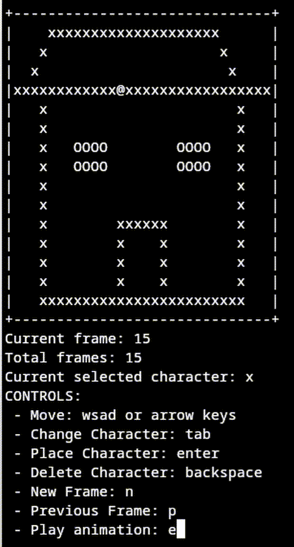

# ASCIIFrame

## 🤔 What is it?

A TUI project that lets you create animations. How does it work then?
You move across the frame (you can set the size) and select an ASCII character.
You can play the animations you make in the program.

## 🚀 Installation

1. Run this command
```bash
git clone https://github.com/tmikolaj/ASCIIFrame
```
2. Open it in your IDE
3. Build and run it

### 🧐 Demo

Just a simple animation I made that draws a house
